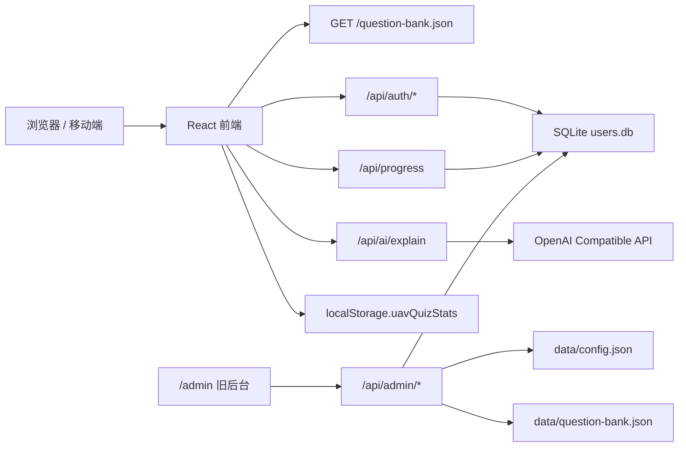

# CAAC 理论题库练习系统项目文档

本文档用于项目交接、二次开发、部署维护和排障。当前项目目录为 `question_bank_site/`。

## 1. 项目概览

CAAC 理论题库练习系统是一个面向无人机 CAAC 理论考试的在线刷题网站，当前已从原生 HTML/CSS/JS 升级为 `React + Vite + TypeScript` 前端，并继续使用 `FastAPI + SQLite` 后端。

核心能力：

- 章节题库练习
- 单选题答题与正确/错误反馈
- 题目解析与 AI 讲解
- 收藏题、不熟题、错题自动整理
- 顺序、随机、错题、收藏、未答优先、高频错题等练习模式
- Dashboard 学习数据面板
- 本地进度持久化与登录后跨设备同步
- 后台管理 AI 配置、题库上传和用户进度

当前已完成 P0/P1/P2 级别升级：基础前端工程化、进度 schema v2、学习体验增强、Dashboard、移动端适配、模拟考试独立页面、考试记录和考后报告。P3/P4 中的后台 React 化、安全和性能治理仍需后续继续推进。

## 2. 技术栈

前端：

- React 19
- Vite
- TypeScript
- lucide-react
- 原生 CSS，使用 CSS variables 组织主题 token

后端：

- Python 3.12
- FastAPI
- SQLite
- Pydantic
- httpx
- Uvicorn

部署：

- Docker Compose
- 多阶段 Docker 构建：Node 构建前端，Python 运行后端
- FastAPI 托管 React `dist/` 静态资源
- Nginx/Cloudflare 反代到源站端口

## 3. 目录结构

```text
question_bank_site/
  src/
    main.tsx                  # React 应用入口、页面和主要组件
    styles.css                # 新版前端样式
    types.ts                  # 题库、进度、考试、用户等类型定义
    services/
      apiClient.ts            # 前端 API client
      analyticsService.ts     # Dashboard 统计逻辑
      practiceEngine.ts       # 答题、筛选、练习模式、错题规则
      progressStore.ts        # 进度 schema、迁移、localStorage 读写、同步合并
  tests/
    analyticsService.test.ts  # Dashboard 统计测试
    practiceEngine.test.ts    # 答题和练习模式测试
    progressStore.test.ts     # 进度迁移和合并测试
  assets/
    enterprise-brand.png
    enterprise-icon.png
  data/
    users.db                  # SQLite 用户、session、进度数据库，生产环境需保留
    question-bank.json        # 后台上传后的题库副本
  dist/                       # Vite 生产构建产物，生成目录
  server.py                   # FastAPI 后端
  admin.html                  # 旧版后台页面，当前仍保留
  admin.js                    # 旧版后台逻辑
  styles.css                  # 旧版后台样式，不能随意删除
  question-bank.json          # 默认题库
  index.html                  # Vite 入口 HTML
  package.json                # 前端脚本和依赖
  vite.config.ts              # Vite 配置和本地 API 代理
  Dockerfile                  # 多阶段构建
  docker-compose.yml          # 服务编排
```

生成目录说明：

- `node_modules/`：本地依赖目录，不应提交或手动同步到服务器。
- `dist/`：构建产物，由 `npm run build` 生成。
- `.test-build/`：测试编译产物。
- `__pycache__/`：Python 缓存目录。

## 4. 系统架构



前端路由：

- `/`：练习页
- `/practice`：练习页
- `/dashboard`：学习数据面板
- `/admin`：旧版后台

后端路由规则：

- `/api/*` 由 FastAPI API 处理。
- `/question-bank.json` 返回当前题库。
- `/admin` 返回旧后台 HTML。
- React 前端路由由 FastAPI fallback 到 `dist/index.html`，避免刷新 404。

## 5. 前端功能说明

### 5.1 练习页

练习页支持：

- 章节选择
- 题目搜索
- 题目状态筛选
- 练习模式切换
- 题目作答
- 答案反馈
- 收藏和不熟标记
- AI 讲解
- 登录、注册、退出和同步状态展示

练习模式：

| 模式 | 说明 |
| --- | --- |
| 顺序练习 | 按题库原顺序练习 |
| 随机练习 | 根据当前筛选条件稳定随机排序 |
| 只练错题 | 只显示 `wrongCount > 0` 的题 |
| 只练收藏 | 只显示收藏题 |
| 未答优先 | 未答题排在前面 |
| 高频错题 | 按错误次数倒序，错误次数相同则按最近作答时间排序 |

筛选条件：

- 全部题目
- 已答
- 未答
- 答错
- 收藏
- 不熟

搜索范围：

- 题干
- 选项
- 章节名

搜索、章节、练习模式和筛选会写入 URL query，刷新后尽量保留当前上下文。

### 5.2 Dashboard

Dashboard 路径：`/dashboard`

展示内容：

- 总题量
- 已练题量
- 正确率
- 错题数
- 收藏数
- 不熟题数
- 最近 7 天练习量
- 章节掌握度
- 高频错题列表

无练习数据时，会显示空状态引导用户先开始刷题。

### 5.3 移动端

移动端采用更集中的刷题体验：

- 顶部栏提供菜单、专注刷题和 Dashboard 切换。
- 侧边栏在小屏幕下变为抽屉。
- 答题区域优先显示题干、选项、答案和解析。
- CSS 已限制横向溢出，适配常见手机宽度。

## 6. 数据结构

### 6.1 题库结构

题库文件：`question-bank.json` 或 `data/question-bank.json`

核心结构：

```json
{
  "title": "理论题库【多旋翼】",
  "subtitle": "多旋翼 / 超视距刷题题库",
  "generatedAt": "2026-06-26",
  "total": 1205,
  "chapters": [
    {
      "name": "飞行手册",
      "count": 44
    }
  ],
  "questions": [
    {
      "id": "q0001",
      "sourceNumber": 1,
      "chapter": "飞行手册",
      "type": "单选",
      "stem": "可能需要处置的紧急情况不包括：",
      "options": [
        { "key": "A", "text": "飞控系统故障" },
        { "key": "B", "text": "上行通讯链路故障" }
      ],
      "answer": "A",
      "explanation": ""
    }
  ]
}
```

注意事项：

- 每道题必须有稳定唯一的 `id`。
- `answer` 必须与某个 option 的 `key` 对应。
- 后台上传题库会写入 `data/question-bank.json`，后端优先读取该文件。

### 6.2 进度结构

当前进度 schema：`progressSchemaVersion = 2`

旧版 `{ answer, correct, updated_at }` 会自动迁移到 v2。

```ts
type ProgressState = {
  progressSchemaVersion: 2;
  questions: Record<string, QuestionProgress>;
  settings: {
    wrongClearStreak: number;
  };
  examRecords: ExamRecord[];
};

type QuestionProgress = {
  answerHistory: Array<{
    answer: string;
    correct: boolean;
    answeredAt: number;
  }>;
  attempts: number;
  wrongCount: number;
  correctStreak: number;
  favorite: boolean;
  weak: boolean;
  lastAnswer: string;
  lastCorrect: boolean | null;
  lastAnsweredAt: number;
};
```

规则：

- 答错后 `wrongCount + 1`，并进入错题状态。
- 答对后 `correctStreak + 1`。
- 默认连续答对 2 次后清除错题状态，即 `wrongCount = 0`。
- 每题最多保留最近 20 条 `answerHistory`，避免进度 JSON 无限膨胀。
- 收藏和不熟是独立标记，不会因答题自动清除。

本地存储：

- key：`localStorage.uavQuizStats`
- token：`localStorage.uavQuizToken`

远端同步：

- 登录后通过 `/api/progress` 保存到 SQLite 的 `progress.stats_json`。
- 本地与远端合并时，以每题 `lastAnsweredAt` 较新的记录为准，同时保留收藏和不熟标记。

## 7. 后端说明

后端入口：`server.py`

主要职责：

- 初始化 SQLite 表
- 用户注册、登录、退出、当前用户查询
- 保存和读取用户进度
- AI 讲解接口
- AI 考试分析接口预留
- 后台登录和管理接口
- 题库读取和后台上传
- 托管 React 静态资源

SQLite 表：

- `users`：用户账号、密码 hash、salt、创建时间
- `sessions`：登录 token、过期时间
- `progress`：用户进度 JSON 和更新时间

数据目录：

- 默认：`question_bank_site/data`
- 可通过环境变量 `DATA_DIR` 指定

配置文件：

- `data/config.json` 保存后台配置的 AI base URL、API key 和模型名。
- `.env` 保存生产环境变量。

## 8. API 概览

认证：

- `POST /api/auth/register`
- `POST /api/auth/login`
- `GET /api/auth/me`
- `POST /api/auth/logout`

进度：

- `GET /api/progress`
- `POST /api/progress`

AI：

- `POST /api/ai/explain`
- `POST /api/ai/exam-analysis`

后台：

- `POST /api/admin/login`
- `GET /api/admin/config`
- `POST /api/admin/config`
- `POST /api/admin/test-ai`
- `GET /api/admin/users`
- `POST /api/admin/users/{user_id}/reset-password`
- `POST /api/admin/users/{user_id}/clear-progress`
- `POST /api/admin/users/{user_id}/delete`
- `GET /api/admin/question-bank`
- `POST /api/admin/question-bank`

静态和页面：

- `GET /question-bank.json`
- `GET /admin`
- `GET /practice`
- `GET /dashboard`

## 9. 本地开发

### 9.1 安装依赖

```bash
cd question_bank_site
npm install
```

### 9.2 启动后端

```bash
cd question_bank_site
python -m uvicorn server:app --host 127.0.0.1 --port 8010
```

### 9.3 启动前端

```bash
cd question_bank_site
npm run dev
```

Vite 代理：

- `/api` -> `http://127.0.0.1:8010`
- `/question-bank.json` -> `http://127.0.0.1:8010`

### 9.4 生产构建

```bash
cd question_bank_site
npm run build
```

构建产物输出到：

```text
question_bank_site/dist/
```

## 10. 测试与质量检查

常用命令：

```bash
cd question_bank_site
npm run lint
npm run test
npm run build
python -m py_compile server.py
```

当前测试覆盖：

- 旧进度迁移到 schema v2
- 本地与远端进度合并
- 答题正确/错误逻辑
- 错题自动加入和连续答对后移除
- 收藏和不熟筛选
- 高频错题排序
- Dashboard 统计

注意：当前 `npm run test` 使用 PowerShell 写入 `.test-build/package.json`，在 Linux CI 中建议后续改为跨平台 Node 脚本。

## 11. 部署维护

生产服务目录：

```text
/opt/uav-question-bank
```

Docker Compose 启动：

```bash
cd /opt/uav-question-bank
docker compose up -d --build
```

端口：

```text
8010:80
```

部署时必须保留：

```text
data/
.env
```

原因：

- `data/users.db` 保存用户、session 和进度。
- `data/config.json` 保存 AI 配置。
- `data/question-bank.json` 可能保存后台上传后的题库。
- `.env` 保存生产环境变量。

推荐部署流程：

1. 在服务器备份当前目录，尤其是 `data/` 和 `.env`。
2. 上传或拉取新代码。
3. 确认 `data/` 和 `.env` 未被覆盖。
4. 执行 `docker compose up -d --build`。
5. 检查容器状态和日志。
6. 验证 `/`、`/dashboard`、`/admin`、`/question-bank.json`。

常用排障命令：

```bash
docker compose ps
docker compose logs -f --tail=200
curl -I http://127.0.0.1:8010/
curl http://127.0.0.1:8010/api/health
curl http://127.0.0.1:8010/question-bank.json
```

## 12. 环境变量

`.env` 示例：

```env
ADMIN_PASSWORD=change-me
OPENAI_BASE_URL=https://api.openai.com/v1
OPENAI_API_KEY=your-api-key
AI_MODEL=gpt-4.1-mini
SESSION_DAYS=30
DATA_DIR=/app/data
```

说明：

- 不要把真实 `.env`、API key、数据库文件提交到公开仓库。
- 后台密码目前仍由 `ADMIN_PASSWORD` 控制。
- AI 配置也可以在后台页面中保存到 `data/config.json`。

## 13. 已知限制

- 模拟考试 P2 已完成：已有 `/exam` 独立页面、题量/时间/章节范围/随机抽题设置、倒计时、答题卡、交卷报告、AI 考试诊断和 `progress.examRecords` 持久化。
- 后台仍基于 `admin.html / admin.js`，已做视觉和功能升级，但尚未迁移到 React。
- 题库上传已可用，但上传前 schema 校验、重复 ID 检查、章节统计预览和 diff 仍需增强。
- 后台用户管理已有列表、统计、重置密码、清空进度和删除用户；完整的单用户进度详情和考试记录详情仍需补齐。
- 后台 token 当前仍等同于后台密码，安全性一般，后续应改为独立 admin session。
- 进度仍以 JSON 存储在 SQLite 中，后续用户量变大时建议拆为结构化表。
- 前端主要组件仍集中在 `src/main.tsx`，后续可进一步拆分为独立组件目录。
- 后端对 progress JSON 的字段白名单校验较弱，后续应增强 schema validation。

## 14. 后续路线

P2：模拟考试与数据分析（已完成）

- `/exam` 独立页面。
- 支持题量、时间、章节范围、是否随机抽题和目标正确率设置。
- 考试中隐藏正确答案和 AI 讲解，显示剩余时间、答题进度、上一题/下一题和答题卡跳转。
- 交卷后展示分数、正确率、错题列表、薄弱章节和复习建议。
- 考试记录持久化到 `progress.examRecords`，Dashboard 展示最近考试摘要和成绩趋势。
- 考试报告 AI 诊断已接入 `/api/ai/exam-analysis`，由用户点击按钮后生成。

P3：后台与题库维护（部分完成）

- 已完成：后台视觉升级、AI 配置、AI 连接测试、题库上传、用户列表、重置密码、清空进度、删除用户、基础统计看板。
- 待完成：后台迁移到 React。
- 待完成：题库上传前增加严格 schema 校验、重复 ID 检查、章节统计预览和上传前 diff。
- 待完成：用户管理增加搜索、分页、单用户进度详情和考试记录详情查看。
- 待完成：AI 配置增加更完整的错误摘要、模型参数说明和调用日志。

P4：部署、性能和安全（部分完成）

- 已完成：Docker 多阶段构建、Vite 静态资源 hash、基础 `.gitignore`、环境变量和数据库文件排除。
- 部分完成：FastAPI 静态文件 no-cache 处理和基础接口日志。
- 待完成：生产静态资源缓存策略系统化。
- 待完成：API 入参字段白名单和 progress schema 服务端校验。
- 待完成：独立 admin session，避免后台密码直接作为 token。
- 待完成：错误日志、AI 调用失败日志和基础监控。
- 待完成：将 progress JSON 拆分为 `question_progress`、`exam_records`、`daily_stats`。

## 15. 开发约定

- 不要直接在组件里散落 `localStorage` 读写，统一走 `progressStore.ts`。
- 题目筛选、排序、错题规则统一放在 `practiceEngine.ts`。
- Dashboard 聚合逻辑统一放在 `analyticsService.ts`。
- API 请求统一通过 `apiClient.ts`。
- 修改进度结构时必须提升 `progressSchemaVersion`，并补充迁移逻辑和测试。
- 修改后台相关文件时，注意旧后台仍依赖根目录 `styles.css`。
- 删除旧文件前先确认生产路径和后台页面没有引用。

## 16. 验收清单

每次上线前至少确认：

- 首页 `/` 能加载题库并显示第一题。
- `/practice` 刷新不 404。
- `/dashboard` 刷新不 404。
- `/admin` 能打开旧后台。
- `/question-bank.json` 返回合法 JSON。
- 注册、登录、退出正常。
- 答题后本地进度能保存。
- 登录后进度能自动同步。
- 收藏、不熟、错题筛选正常。
- AI 讲解接口能返回或显示明确错误。
- 移动端宽度下无横向滚动。
